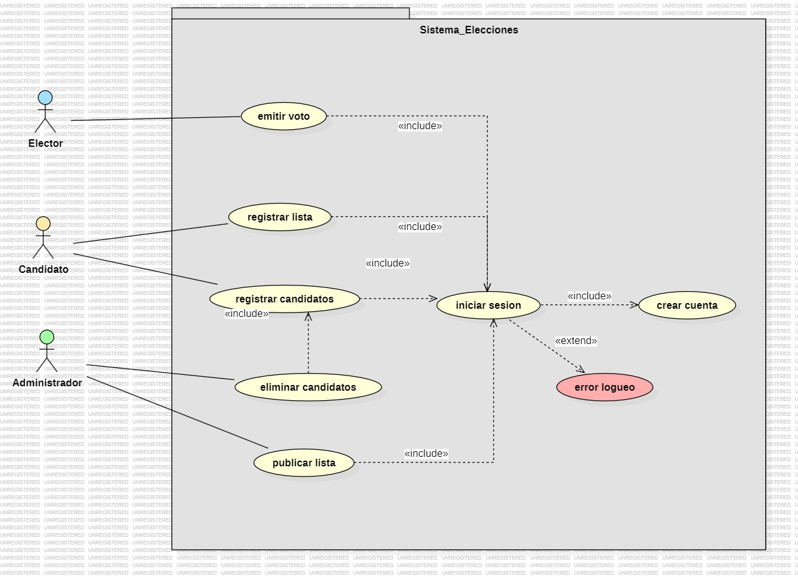
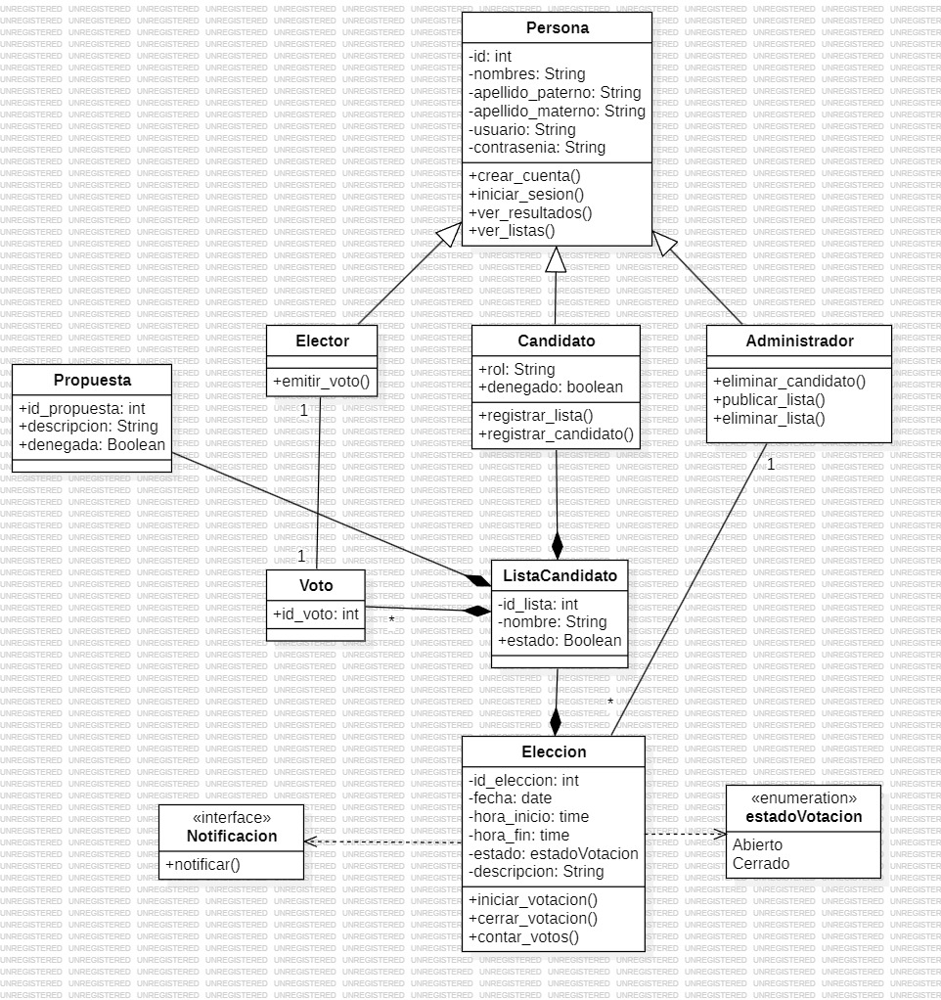
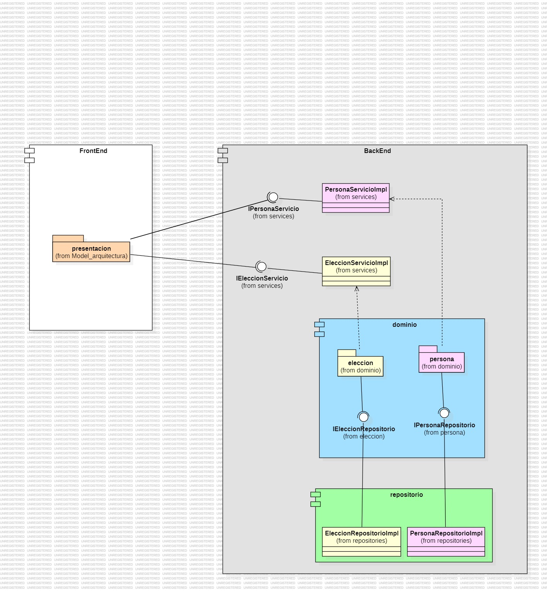

# **Proyecto Final: Votaciones Online**

**Equipo:** Los Refugiados

**Miembros:**

-   Arleen Maritza Ferro Vasquez
-   Wilson Isaac Mamani Casilla
-   Jazmin Gabriela Perez Villasante
-   Cristhian David Huanca Olazabal
-   Sebastian Andres Mendoza Fernandez
-   Edilson Bonet Mamani Yucra

## Especificación del Proyecto

El Proyecto Final debe implementar una aplicación web con las siguientes características:

### Funcionalidades

-   **Interfaz gráfica de usuario**: Utilizando cualquier lenguaje, biblioteca o framework.
-   **Persistencia en bases de datos**: Soporte para MySQL, SQLite, MongoDB u otro sistema de bases de datos.

### Requisitos de desarrollo

-   **Patrones/Estilos de arquitectura de software**:
    -   Uso de patrones de diseño adecuados.
    -   Arquitectura escalable y mantenible.
-   **Prácticas de desarrollo de software**:
    -   **Estilos de codificación**: Adherencia a guías de estilo para el lenguaje elegido.
    -   **Codificación Limpia (Clean Code)**: Código legible, mantenible y con buena organización.
    -   **Principios SOLID**: Aplicación de los principios de diseño de software.
    -   **Domain-Driven Design (DDD)**: Diseño orientado al dominio para modelar el negocio de manera efectiva.

## Entregible

### Proyecto (codigo fuente y documentacion) en Github

Puedes encontrar el código fuente y la documentación del proyecto en el siguiente enlace:
[Elección Online - GitHub](https://github.com/Aferrov/Eleccion-Online)

### Planificación de Tareas

La planificación de tareas de implementación se gestiona usando la herramienta Trello. Puedes ver el tablero con todas las tareas del proyecto en el siguiente enlace:
[Sistema de Elecciones - Trello](https://trello.com/b/dr4vfErF/sistema-de-elecciones)

### Documento de requisitos de software actualizado

[Requisitos](https://docs.google.com/document/d/14P_PVLfjSm_YSb5pkw98cLnqFf8kFPsR/edit?usp=sharing&ouid=103974025895514464791&rtpof=true&sd=true)

### Documento de arquitectura de software actualizado

[Arquitectura](https://docs.google.com/document/d/1cbHVusBtsyzv-eA0EU2F89KYerfHQLAP/edit?usp=sharing&ouid=103974025895514464791&rtpof=true&sd=true)

### Documentacion del Proyecto en GitHub

### Proposito del proyecto

El propósito de este proyecto es desarrollar una aplicación web de votaciones online que permita a los usarios participar en procesos electorales de manera segura y eficiente. La aplicación está diseñada para:

-   **Facilitar el voto en linea:** Proporcionar una plataforma intuitiva y accesible para que los votantes puedan emitir su voto desde cualquier lugar y momento.
-   **Promover la transparencia:** Asegurar que todo el proceso sea transparente y verificable, permitiendo a los participantes y organizadores auditar y revisar los resultados.
-   **Mejorar la gestion electoral:** Ofrecer herramientas para la administracion y supervision de las votaciones, simplificando la organizacion y el conteo de votos.
-   **Garantizar la integridad y seguridad:** Implementar medidas robustas para asegurar que el proceso de votacion sea seguro y que los resultados sean precisos y confiables.

### Funcionalidades: Diagrama de Casos de Uso, Funcionalidades de Alto Nivel y Prototipo (o GUI)



#### Modelo de Dominio: Diagrama de Clases y Módulos



#### Arquitectura y Patrones: Diagrama de Componentes o Paquetes



### **Prácticas de codificación limpia aplicadas:**

**1. Nombres Descriptivos**

Las clases y métodos tienen nombres claros y descriptivos, lo que facilita la comprensión del propósito del código. Ejemplos incluyen:

-   Clases como `Elector`, `Candidato`.
-   Métodos como `hash_contrasena`, `revisar_contrasena`, y `emitir_voto`.

```Python
class Elector(db.Model):
    # ...

    def hash_contrasena(self, contrasena):
        return bcrypt.hashpw(contrasena.encode('utf-8'), bcrypt.gensalt()).decode('utf-8')

    def revisar_contrasena(self, contrasena):
        return bcrypt.checkpw(contrasena.encode('utf-8'), self.contrasena.encode('utf-8'))

    def emitir_voto(self, candidato_id):
        # Lógica para emitir el voto
        pass
```

**2. Funciones Pequeñas**

Los métodos están diseñados para realizar tareas específicas y bien definidas. Por ejemplo:

-   `hash_contrasena` para encriptar contraseñas.
-   `revisar_contrasena` para verificar la validez de una contraseña.
-   `emitir_voto` para registrar un voto.

**3. Encapsulacion**

La lógica de manejo de contraseñas y emisión de votos está contenida dentro de las clases correspondientes. Esto asegura que las responsabilidades estén bien definidas y separadas.

**4. Manejo de Execiones**

Se utiliza bloques `try-except` para manejar excepciones y registrar errores. Esto ayuda a asegurar que el sistema maneje errores de manera controlada y registre información útil para la depuración.

```Python
class EleccionServicioImpl(IEleccionServicio):
    def get_all_eleccion(self, modo):
        try:
            # Lógica para obtener elecciones según el modo
        except Exception as e:
            logger.error(f'Error al obtener todas las elecciones: {str(e)}')
            raise e

```

**5. Responsabilidad Unica**

Cada clase tiene una sola responsabilidad clara, siguiendo el principio de Responsabilidad Única. Ejemplos incluyen:

-   `EleccionServicioImpl` para manejar elecciones.
-   `VotoServicioImpl` para manejar votos.
-   `CandidatoServicioImpl` para manejar candidatos.
-   `ListaServicioImpl` para manejar listas de candidatos.

```Python
class EleccionServicioImpl(IEleccionServicio):
    def get_all_eleccion(self, modo):
        try:
            # Lógica para obtener elecciones según el modo
        except Exception as e:
            logger.error(f'Error al obtener todas las elecciones: {str(e)}')
            raise e
```

**6. Interfaces Claras**

Las interfaces definen claramente los métodos esperados para cada servicio, lo que facilita la comprensión y la implementación de las clases concretas. Cada método tiene un propósito claro, y las interfaces actúan como contratos entre las partes del sistema. Esto asegura que las clases implementadoras sigan un contrato bien definido y proporcionen las funcionalidades necesarias.

```python
from abc import ABC, abstractmethod

class IEleccionServicio(ABC):
    @abstractmethod
    def get_all_eleccion(self):
        """Método para obtener todas las elecciones."""
        pass

    @abstractmethod
    def get_candidatos_by_eleccion(self, id_eleccion: int):
        """Método para obtener candidatos por ID de elección."""
        pass

    @abstractmethod
    def get_all_eleccion_abiertas(self):
        """Método para obtener todas las elecciones abiertas."""
        pass

    @abstractmethod
    def insert_eleccion(self, eleccion):
        """Método para insertar una nueva elección."""
        pass

    @abstractmethod
    def get_elecciones_hechas_por_elector(self, id_elector):
        """Método para obtener elecciones hechas por un elector."""
        pass

    @abstractmethod
    def get_all_elecciones(self):
        """Método para obtener todas las elecciones."""
        pass
```

**7. Consitencia en la Definicion de Metodos**

Las interfaces tienen métodos consistentes y bien definidos que corresponden a las operaciones de servicio requeridas. Esto facilita la implementación de las clases concretas al proporcionar una guía clara sobre qué métodos deben ser implementados y qué parámetros deben recibir.

**Ejemplo de Código:**

En el fragmento de código anterior, los métodos están claramente definidos con parámetros específicos y comentarios que describen su propósito. Esto garantiza que cualquier clase que implemente la interfaz `IEleccionServicio` se adhiera a la estructura y funcionalidad esperada.

### Estilos de Programación aplicados:

**Cookbook**

Se siguen patrones comunes como CRUD (Create, Read, Update, Delete) para la gestión de electores. Los métodos `create_elector`, `get_elector_by_id`, `update_elector`, y `delete_elector` son ejemplos claros de este enfoque. Asimismo, las rutas para registro, login, dashboard y logout siguen patrones típicos de manejo de sesiones y autenticación.

```Python
class ElectorServiceImpl(ElectorService):
    def get_elector_by_id(self, id):
        return Elector.query.get(id)

    def update_elector(self, elector: Elector):
        try:
            db.session.merge(elector)
            db.session.commit()
            logger.info(f'Elector actualizado correctamente: {elector}')
        except Exception as e:
            db.session.rollback()
            logger.error(f'Error al actualizar el elector: {str(e)}')
            raise e

    def delete_elector(self, elector: Elector):
        try:
            db.session.delete(elector)
            db.session.commit()
            logger.info(f'Elector eliminado correctamente: {elector}')
        except Exception as e:
            db.session.rollback()
            logger.error(f'Error al eliminar el elector: {str(e)}')
            raise e
```

**Pipeline**

El estilo Pipeline se enfoca en el flujo de datos a través de varias etapas. Puedes organizar tu código de manera que cada función o método sea un paso en un pipeline, facilitando la comprensión y el mantenimiento.

```Python
# Pipeline Style: Register Candidates Flow
@home_bp.route('/register_candidates', methods=['POST'])
def register_candidates():
    try:
        # Step 1: Get Data
        nombre_partido, campana = get_candidate_data()
        id_lista = create_candidate_list(nombre_partido, campana)

        # Step 2: Create Proposals
        create_proposals(id_lista)

        # Step 3: Create Candidates
        create_candidates(id_lista)

        flash('Candidatos y propuestas registrados con éxito', 'success')
    except Exception as e:
        flash(f'Error al registrar candidatos y propuestas: {str(e)}', 'danger')

    return render_template('inscripcion.html')
```

**Error/Exception Handling**

El estilo Error/Exception Handling se enfoca en manejar errores de manera adecuada, lo cual ya estás haciendo en la mayoría de tus métodos con `try/except`, y `flash` como se observa en el codigo anterior.

```Python
class VotoServicioImpl(IVotoServicio):

    def get_voto_by_elector(self, id_elector):
        try:
            # Consulta para obtener votos del elector por ID
            # Procesar y devolver el resultado
        except Exception as e:
            # Registrar y relanzar excepción en caso de error
            raise e

    def votar(self, id_lista, id_elector):
        try:
            # Crear y agregar nuevo voto a la base de datos
            # Procesar y devolver el resultado
        except Exception as e:
            # Deshacer cambios y registrar error en caso de excepción
            raise e

    def get_all_votos(self):
        try:
            # Consulta para obtener todos los votos junto con información de elector y lista
            # Procesar y devolver el resultado
        except Exception as e:
            # Registrar y relanzar excepción en caso de error
            raise e

    def get_cant_votos_by_eleccion(self, id_eleccion):
        try:
            # Consulta para obtener la cantidad de votos por lista en una elección específica
            # Procesar y devolver el resultado
        except Exception as e:
            # Registrar y relanzar excepción en caso de error
            raise e
```

**Trinity(MVC)**

El patrón Trinity (MVC) es una arquitectura de software que separa las responsabilidades de una aplicación en tres componentes principales: Modelo, Vista y Controlador. Esta separación facilita el mantenimiento y escalabilidad del código. A continuación, se describe cómo se aplica este patrón en el proyecto.

**1.Modelo**

El Modelo representa la lógica de datos y las estructuras de la aplicación. En este proyecto, se definen las siguientes clases de modelo:

-   `Eleccion:` Representa las elecciones en el sistema.
-   `Candidato:` Representa los candidatos asociados a las listas de candidatos.
-   `ListaCandidato:` Representa las listas de candidatos que están asociadas a una elección.
-   `Propuesta:` Representa las propuestas dentro de una lista de candidatos

```Python
# models/eleccion.py
class Eleccion(db.Model):
    __tablename__ = 'eleccion'
    id_eleccion = db.Column(db.Integer, primary_key=True, autoincrement=True)
    fecha = db.Column(db.Date, nullable=False)
    hora_inicio = db.Column(db.Time, nullable=False)
    hora_fin = db.Column(db.Time, nullable=False)
    estado = db.Column(db.String(50), nullable=False)
    descripcion = db.Column(db.String(255), nullable=True)
```

```Python
# models/candidato.py
class Candidato(db.Model):
    __tablename__ = 'candidato'
    id_candidato = db.Column(db.Integer, primary_key=True, autoincrement=True)
    dni = db.Column(db.String(20), unique=True, nullable=False)
    nombres = db.Column(db.String(100), nullable=False)
    apellido_paterno = db.Column(db.String(100), nullable=False)
    apellido_materno = db.Column(db.String(100), nullable=False)
    rol = db.Column(db.String(50), nullable=False)
    id_lista = db.Column(db.Integer, db.ForeignKey('listacandidato.id_lista'), nullable=False)

```

**2.Vista**

La Vista es responsable de la presentación de los datos al usuario. En el proyecto, las rutas de Flask que devuelven plantillas HTML son parte de la vista. Estas rutas permiten a los usuarios interactuar con la aplicación y ver la información presentada de manera estructurada.

```Python
@home_bp.route('/ListasEleccionesVista', methods=['GET'])
def listar_candidatos_elector():
    listas = lista_servicio.obtener_listas_aprobadas()
    return render_template('ListaCandidato/listas_aprobadas.html', listas=listas)

@home_bp.route('/EleccionesActivas', methods=['GET'])
def listar_elecciones():
    elecciones_json = eleccion_servicio.get_all_eleccion(4)
    return render_template('lista_eleccion.html', elecciones=elecciones_json)

@home_bp.route('/candidatos/<int:id>', methods=['GET'])
def ver_lista_candidatos(id):
    listas_candidato = lista_servicio.get_lista_por_eleccion(id)
    if listas_candidato is None:
        abort(404)
    return render_template('ListaCandidato/lista_candidatos.html', listas=listas_candidato)
```

**3.Controlador**

El Controlador maneja las solicitudes HTTP, interactúa con el modelo y selecciona la vista adecuada para la respuesta. Los métodos del controlador coordinan la lógica de negocio y la presentación de datos al usuario.

```Python
def insertar_eleccion():
    fecha = request.form['fecha']
    hora_inicio = request.form['hora_inicio']
    hora_fin = request.form['hora_fin']
    estado = request.form['estado']
    descripcion = request.form['descripcion']
    eleccion = Eleccion(fecha, hora_inicio, hora_fin, estado, descripcion)
    eleccion_servicio.insert_eleccion(eleccion)
    return redirect(url_for('home_bp.listar_elecciones'))

def ver_candidatos():
    id_eleccion = request.form['eleccion_id']
    result = lista_servicio.get_lista_by_eleccion(id_eleccion)
    return render_template("lista_candidatos.html", data=result)

def votar():
    id_lista = request.form['id_lista']
    elector = elector_service.get_elector_by_email(session['correo'])
    voto_servicio.votar(id_lista, elector.id)
    return redirect(url_for('home_bp.dashboard'))
```

### Principios SOLID aplicados:

**1. Single Responsibility Principle (SRP) - Principio de Responsabilidad Única**

Cada clase o método tiene una única responsabilidad clara. Aquí algunos ejemplos:

-   `EleccionServicioImpl`:

```Python
class EleccionServicioImpl(IEleccionServicio):
    def get_all_eleccion(self, modo):
        # Obtener elecciones basadas en el modo
        pass

    def get_candidatos_by_eleccion(self, id_eleccion):
        # Obtener candidatos por ID de elección
        pass

    def insert_eleccion(self, eleccion):
        # Insertar una nueva elección
        pass

    def get_elector_by_email(self, email):
        # Obtener elector por correo electrónico
        pass

    def get_all_elecciones(self):
        # Obtener todas las elecciones
        pass
```

-   `VotoServicioImpl`:

Maneja operaciones relacionadas con los votos, como registrar un voto y obtener la cantidad de votos por lista.

```Python
class VotoServicioImpl(IVotoServicio):
    def get_voto_by_elector(self, id_elector):
        # Obtener voto por ID de elector
        pass

    def votar(self, id_lista, id_elector):
        # Registrar un voto
        pass

    def get_all_votos(self):
        # Obtener todos los votos
        pass

    def get_cant_votos_by_eleccion(self, id_eleccion):
        # Obtener cantidad de votos por ID de elección
        pass
```

**2. Open/Closed Principle (OCP) - Principio de Abierto/Cerrado**

Las clases están abiertas para extensión pero cerradas para modificación. El uso de interfaces permite extender funcionalidades sin cambiar el código existente.

-   Interfaces `IEleccionServicio`, `IVotoServicio`, `ICandidatoServicio`, `IListaServicio`: Permiten agregar nuevas implementaciones sin modificar el código que usa estas interfaces.

```Python
class IEleccionServicio(ABC):
    @abstractmethod
    def get_all_eleccion(self, modo):
        pass

    @abstractmethod
    def get_candidatos_by_eleccion(self, id_eleccion):
        pass

    # Otros métodos...

class IVotoServicio(ABC):
    @abstractmethod
    def get_voto_by_elector(self, id_elector):
        pass

    @abstractmethod
    def votar(self, id_lista, id_elector):
        pass

    # Otros métodos...
```

**3. Dependency Inversion Principle (DIP) - Principio de Inversión de Dependencias**

Las dependencias deben estar abstraídas. El código depende de interfaces y no de implementaciones concretas.

-   Dependencia de interfaces en las clases de servicio:

```Python
class EleccionServicioImpl(IEleccionServicio):
    # Implementación de métodos de la interfaz
    pass

class VotoServicioImpl(IVotoServicio):
    # Implementación de métodos de la interfaz
    pass
```

-   Uso de interfaces en los métodos:

```Python
def get_candidatos_by_eleccion(self, id_eleccion):
    # Dependencia en la interfaz IEleccionServicio
    pass

```

**4. Liskov Substitution Principle (LSP) - Principio de Sustitución de Liskov**

Para cumplir con el Principio de Sustitución de Liskov, cualquier clase que implemente `ElectorService` debe poder sustituir a `ElectorService` sin alterar el comportamiento esperado. La implementación de `ElectorServiceImpl` debe adherirse a esta regla, garantizando que el sistema siga funcionando correctamente al reemplazar `ElectorService` por `ElectorServiceImpl`.

```Python
class ElectorServiceImpl(ElectorService):
    def get_elector_by_id(self, id):
        ...

    def create_elector(self, elector_modelo, contrasena:str):
        ...

    def update_elector(self, elector: Elector):
        ...

    def delete_elector(self, elector: Elector):
        ...

    def get_elector_by_email(self, email):
        ...
```

**5. Interface Segregation Principle (ISP) - Principio de Segregación de Interfaces**

Para cumplir con el Principio de Segregación de Interfaces, las interfaces deben ser específicas para cada cliente. La interfaz `ElectorService` está bien definida porque solo incluye métodos relevantes para la gestión de electores.

```Python
class ElectorService(ABC):
    @abstractmethod
    def get_elector_by_id(self, id):
        pass

    @abstractmethod
    def create_elector(self, elector, contrasena:str):
        pass

    @abstractmethod
    def update_elector(self, elector):
        pass

    @abstractmethod
    def delete_elector(self, elector):
        pass

    @abstractmethod
    def get_elector_by_email(self, email):
        pass
```

### Conceptos DDD aplicados:

-   **Entidades:**

Las entidades son objetos con identidad propia que mantienen su existencia incluso si sus atributos cambian. En el código, `Elector`, `Candidato` y `Eleccion` son ejemplos de entidades.

```Python
class Elector(db.Model):
    __tablename__ = 'elector'
    id = db.Column(db.Integer, primary_key=True)  # Identificador único
    # Atributos adicionales

class Candidato(db.Model):
    __tablename__ = 'candidato'
    id_candidato = db.Column(db.Integer, primary_key=True)  # Identificador único
    # Atributos adicionales

class Eleccion(db.Model):
    __tablename__ = 'eleccion'
    id_eleccion = db.Column(db.Integer, primary_key=True)  # Identificador único
    # Atributos adicionales
```

-   **Objetos de Valor:**

Aunque no hay clases de objetos de valor explícitas, algunas propiedades como `contrasena` en `Elector` se gestionan como objetos de valor, ya que se manejan internamente y se transforman (e.g., hash de la contraseña) para preservar su integridad.

-   **Servicios de Dominio:**

Los Servicios de Dominio contienen lógica que no encaja directamente en una entidad u objeto de valor. En el código, `ElectorService` es un ejemplo de un servicio de dominio.

```Python
class ElectorService(ABC):
    @abstractmethod
    def get_elector_by_id(self, id):
        pass
    # Métodos adicionales

class ElectorServiceImpl(ElectorService):
    def get_elector_by_id(self, id):
        # Implementación concreta
        pass
```

-   **Agregados y Módulos:**

Agregados son grupos de entidades y objetos de valor que se tratan como una unidad coherente. En este caso, podemos considerar `Eleccion` como un agregado que contiene `ListaCandidato` y `Candidato`.

```Python
class Eleccion(db.Model):
    __tablename__ = 'eleccion'
    id_eleccion = db.Column(db.Integer, primary_key=True)
    listas = db.relationship('ListaCandidato', backref='eleccion')

class ListaCandidato(db.Model):
    __tablename__ = 'listacandidato'
    id_lista = db.Column(db.Integer, primary_key=True)
    candidatos = db.relationship('Candidato', backref='lista_candidato')
```

-   **Fábricas y Repositorios:**

Aunque no se ve una clase de fábrica explícita, el uso de constructores en las entidades (`Elector`, `Candidato`, `Eleccion`) funciona como una fábrica, ya que crean instancias de estas entidades con atributos específicos.

En este caso los repositorios proporcionan una interfaz para el acceso a las entidades. `ElectorServiceImpl` actúa como un repositorio en este caso.

```Python
class ElectorServiceImpl(ElectorService):
    def get_elector_by_id(self, id):
        return Elector.query.get(id)
    # Métodos adicionales
```

-   **Arquitectura en Capas:**

Separa las responsabilidades en capas distintas como presentación, aplicación, dominio y persistencia.

-   **Capa de Dominio:** Contiene entidades, objetos de valor, y lógica de negocio (ej. Elector, Eleccion).
-   **Capa de Aplicación:** Contiene servicios de dominio (ej. IEleccionServicio, IVotoServicio).
-   **Capa de Persistencia:** Contiene acceso a datos (ej. uso de db.session en las implementaciones de servicio).
-   **Capa de Presentación:** No incluida explícitamente en el código, pero sería responsable de interactuar con los servicios para exponer los datos (ej. a través de rutas Flask).
